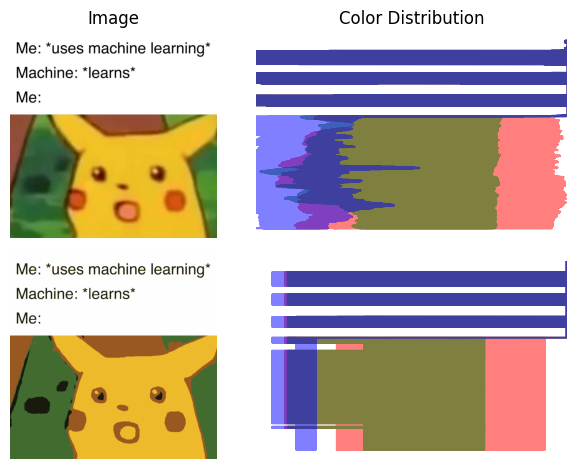
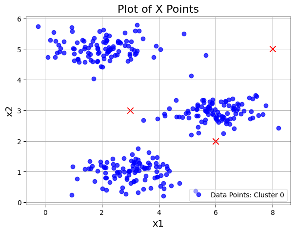
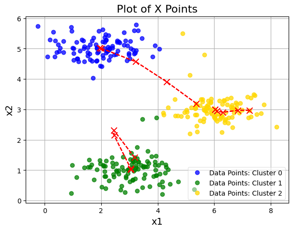
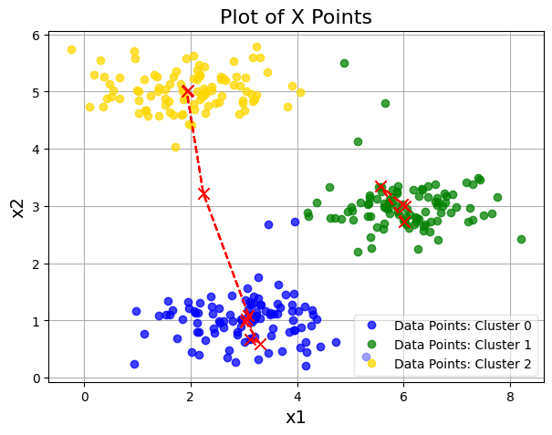
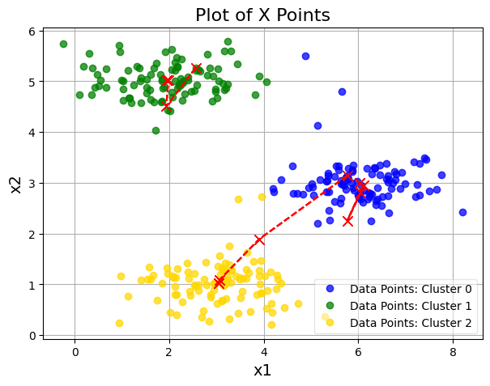

# ImageCompression
Image Compression with K-means Clustering

An elegant implementation of the **K-Means Clustering** algorithm from scratch, applied to color quantization and image compression. This project reduces the storage footprint of an image by limiting its visual spectrum to a fixed number of representative colors (centroids) without destroying its structural integrity.

## 🚀 Visual Project Overview

### 1. Color Space Quantization & Distribution
The project processes the pixels of an image as three-dimensional data points $(R, G, B)$ in a continuous color space. By fitting a K-means model, we group similar color distributions into distinct clusters:

  

### 2. Centroid Optimization Process
As I implement K-Means, I use a dataset `data.mat`.

  

During training, cluster centroids move through the feature space to minimize the total intra-cluster variance. Below is an optimization trace showcasing how initial random centroids converge over successive iterations to find the optimal dominant colors:

  
  
  

---

## 📊 Before & After Comparison

By compression-mapping thousands of distinct color shades into just a few optimized cluster centroids, we achieve high-efficiency color quantization.

| Original High-Resolution Image | Compressed K-Means Image ($K=16$) |
| :---: | :---: |
|  |  |

---

